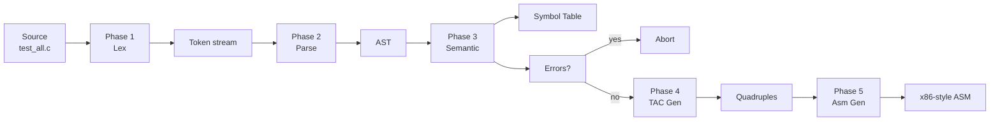

# Mini C Compiler in Python

**Target:** Tokens → AST → Symbol Table → TAC → Assembly

---

## Agenda

4. **Phase 1 — Lexical Analysis** (with demo)
5. **Phase 2 — Syntax Analysis** (with demo)
6. **Phase 3 — Semantic Analysis & Symbol Table** (with demo)
7. **Phase 4 — Three-Address Code Generation** (with demo)
8. **Phase 5 — Target Code Generation (Assembly)** (with demo)
9. Error detection mechanism
10. Full integration demo
11. Statistics, conclusion, references

---

## Problem Definition

**Goal:** Build a mini compiler that takes a small C-like program and produces:
- A complete dump of every phase output
- Three-address code
- x86-style pseudo-assembly

**Scope:**
- Subset of C: declarations, expressions, control flow, functions, I/O
- Single-file source program
- Phase-by-phase output (educational, not optimized)
- Error detection at lex / syntax / semantic levels

**Why?**
- Reinforces all compiler-construction concepts taught in lab
- Exercises lex/yacc-style tools in a modern stack
- Produces inspectable artifacts at every step

---

## Architecture — High Level

```
┌──────────────┐    ┌─────────┐    ┌────────┐    ┌──────────────┐    ┌─────┐    ┌──────────┐
│  source.c    │ →  │  Lexer  │ →  │ Parser │ →  │   Semantic   │ →  │ TAC │ →  │ Assembly │
│  (C subset)  │    │  (PLY)  │    │ (PLY)  │    │ + Sym Table  │    │ Gen │    │   Gen    │
└──────────────┘    └─────────┘    └────────┘    └──────────────┘    └─────┘    └──────────┘
                       │              │               │                 │           │
                       ▼              ▼               ▼                 ▼           ▼
                    Token         Abstract        Scoped            Quadruple    x86-style
                    Stream         Syntax       Symbol Table         List        Pseudo-asm
                    + log          Tree           + errors
```

**Five distinct phases** — each phase prints its output → easy demo and debugging.

---

## Pipeline Flow (Mermaid)



Every arrow = data passed between phases. Every box = one Python module.

---

## Source Language — Supported Features

| Category | Features |
|----------|----------|
| **Data types** | `int`, `float`, `void`, `char` |
| **Literals** | integer (`42`), float (`3.14`), string (`"hi"`) |
| **Arithmetic** | `+ - * / %` and unary `-` |
| **Relational** | `< > <= >= == !=` |
| **Logical** | `&& \|\| !` |
| **Assignment** | `=` (also as chainable expression: `a = b = c = 9`) |
| **Control flow** | `if` / `else`, `while`, `for` |
| **Functions** | declarations, multiple params, recursion, `return` |
| **I/O** | `printf(arg1, arg2, ...)` — multi-argument |
| **Comments** | `// line` and `/* block */` |
| **Scoping** | global + per-function scopes, parameter shadowing |

---

## Project File Structure

```
mini_compiler_py/
├── lexer.py         # Phase 1 — PLY-based tokenizer
├── parser.py        # Phase 2 — PLY-based LALR(1) parser
├── ast_nodes.py     # AST dataclasses + pretty-printer
├── symbol_table.py  # Scoped symbol table
├── semantic.py      # Phase 3 — type/scope checks
├── codegen.py       # Phase 4 + Phase 5 — TAC + assembly
├── main.py          # Driver — orchestrates all 5 phases
├── test1.c          # demo: factorial + while + if/else
├── test2_error.c    # demo: error detection
├── test_all.c       # demo: every language feature
└── out_test_all.txt # full output dump (3010 lines)
```

**Modular design** — one phase per file, clean interfaces.

---

## Tooling — Why PLY?

**PLY = Python Lex-Yacc** (David Beazley)

| Aspect | Classic flex/bison | PLY |
|--------|--------------------|-----|
| Token regex syntax | `[0-9]+ { ... }` | `t_NUMBER = r"\d+"` |
| Grammar rule syntax | `expr : expr PLUS expr` | docstring `"expr : expr PLUS expr"` |
| Lex algorithm | regex → DFA | regex → DFA |
| Parser algorithm | LALR(1) | LALR(1) |
| Generated artefact | `lex.yy.c`, `parser.tab.c` | in-memory tables |
| Host language | C | Python |

**Same theory, same conventions** — just runs inside Python with no compile step.

---

## How to Run

```powershell
# install dependency
pip install ply

# enter folder
cd f:\compiler\mini_compiler_py

# run on built-in demos
python main.py test1.c           # factorial + while + if/else
python main.py test2_error.c     # semantic errors halt compilation
python main.py test_all.c        # full-feature exercise

# capture full output to a file
python main.py test_all.c > out_test_all.txt
```

Five phases of output appear, each separated by a `===` banner.

---

# Phase 1 — Lexical Analysis

## Job: split source text → stream of tokens

---

## Phase 1 — Lexical Analysis (Concept)

Input: raw source text (string)
Output: ordered list of tokens, each with `{ type, value, line, column }`

Tasks the lexer performs:
- Strip whitespace
- Strip single-line `//` and block `/* */` comments
- Recognise integer + float literals
- Recognise string literals `"..."`
- Recognise identifiers and promote reserved words to keywords
- Recognise operators (`+`, `==`, `&&`, ...) and punctuation
- Track line number + column for every token
- Report illegal characters with line info

Implementation tool: **`ply.lex`** — regex-driven DFA generator.

---

## Phase 1 — Token Categories

| Category | Token names |
|----------|-------------|
| Keywords | `INT FLOAT VOID CHAR IF ELSE WHILE FOR RETURN BREAK CONTINUE PRINTF` |
| Literals | `NUMBER FNUM STRING` |
| Identifiers | `ID` |
| Arithmetic | `PLUS MINUS MUL DIV MOD` |
| Relational | `EQ NE LE GE LT GT` |
| Logical | `AND OR NOT` |
| Assignment | `ASSIGN` |
| Punctuation | `LPAREN RPAREN LBRACE RBRACE SEMI COMMA` |

Total: **26 distinct token types**.

Reserved words use a lookup dictionary so the same regex matches identifiers and keywords — then promotes the type when matched.

---

## Phase 1 — Code Walkthrough (lexer.py)

```python
import ply.lex as lex

reserved = {
    "int": "INT", "float": "FLOAT", "void": "VOID", "char": "CHAR",
    "if": "IF", "else": "ELSE", "while": "WHILE", "for": "FOR",
    "return": "RETURN", "break": "BREAK", "continue": "CONTINUE",
    "printf": "PRINTF",
}

tokens = ["NUMBER", "FNUM", "STRING", "ID",
          "PLUS","MINUS","MUL","DIV","MOD",
          "ASSIGN","EQ","NE","LE","GE","LT","GT",
          "AND","OR","NOT",
          "LPAREN","RPAREN","LBRACE","RBRACE","SEMI","COMMA"
         ] + list(set(reserved.values()))

# simple regex rules — order doesn't matter, PLY sorts by length
t_PLUS  = r"\+";    t_MINUS = r"-";   t_MUL = r"\*";  t_DIV = r"/"
t_EQ    = r"==";    t_NE    = r"!=";  t_LE  = r"<=";  t_GE  = r">="
t_AND   = r"&&";    t_OR    = r"\|\|"; t_NOT = r"!"
```

---

## Phase 1 — Code Walkthrough (continued)

```python
# function-form tokens — order matters (longer first)
def t_COMMENT_BLOCK(t):
    r"/\*(.|\n)*?\*/"
    t.lexer.lineno += t.value.count("\n")   # consume + track lines

def t_COMMENT_LINE(t):
    r"//[^\n]*"                              # consume, no token

def t_FNUM(t):
    r"\d+\.\d+"
    t.value = float(t.value); return t

def t_NUMBER(t):
    r"\d+"
    t.value = int(t.value); return t

def t_ID(t):
    r"[A-Za-z_][A-Za-z0-9_]*"
    if t.value in reserved:
        t.type = reserved[t.value]           # keyword promotion
    return t
```

---

## Phase 1 — Demo Source

```c
int a = 5;
int b = 10;
c = a + b * 2;
if (c > 20) { printf(c); }
```

## Phase 1 — Output (token table)

```
#   Type        Value             Line  Col
--------------------------------------------
0   INT         'int'             1     1
1   ID          'a'               1     5
2   ASSIGN      '='               1     7
3   NUMBER      5                 1     9
4   SEMI        ';'               1    10
5   INT         'int'             2     1
6   ID          'b'               2     5
7   ASSIGN      '='               2     7
8   NUMBER      10                2     9
...
```

Every token annotated with file location → underpins error messages.

---

# Phase 2 — Syntax Analysis

## Job: tokens → Abstract Syntax Tree (AST)

---

## Phase 2 — Concept

Tokens are a **flat list**. Code structure is **nested** (precedence, blocks, scopes).

Parser builds a tree:

```
Source:    c = a + b * 2;

Tokens:    ID(c) ASSIGN ID(a) PLUS ID(b) MUL NUMBER(2) SEMI

AST:
           Assign(name='c')
              └── value = BinOp(op='+')
                            ├── left  = Var('a')
                            └── right = BinOp(op='*')
                                          ├── left  = Var('b')
                                          └── right = IntLit(2)
```

Tree shape encodes **precedence** (`*` deeper = evaluated first) and **nesting** (blocks, control flow).

Tool: **`ply.yacc`** — LALR(1) parser generator.

---

## Phase 2 — Grammar (BNF-style)

```
program     := decl_list
decl_list   := decl_list top_decl | ε
top_decl    := function | global_var
function    := type ID '(' params ')' block
block       := '{' stmt_list '}'
stmt_list   := stmt_list stmt | ε

stmt        := decl_stmt | expr_stmt | if_stmt | while_stmt
             | for_stmt | return_stmt | printf_stmt | block

decl_stmt   := type ID ';' | type ID '=' expr ';'
if_stmt     := 'if' '(' expr ')' stmt ['else' stmt]
while_stmt  := 'while' '(' expr ')' stmt
for_stmt    := 'for' '(' for_init [expr] ';' [expr] ')' stmt
return_stmt := 'return' [expr] ';'
printf_stmt := 'printf' '(' arg_list ')' ';'

expr        := ID '=' expr | binop_chain
```

---

## Phase 2 — Operator Precedence Table

```python
precedence = (
    ("right",   "ASSIGN"),                          # lowest
    ("left",    "OR"),
    ("left",    "AND"),
    ("nonassoc","EQ", "NE"),
    ("nonassoc","LT", "GT", "LE", "GE"),
    ("left",    "PLUS", "MINUS"),
    ("left",    "MUL", "DIV", "MOD"),
    ("right",   "UMINUS", "NOT"),                    # highest
)
```

Matches **C language precedence** — lets us write a single rule

```python
def p_expr_binop(p):
    """expr : expr PLUS expr | expr MUL expr | ..."""
    p[0] = A.BinOp(op=p[2], left=p[1], right=p[3])
```

and have PLY resolve `a + b * c` correctly using the table.

---

## Phase 2 — AST Node Library

17 dataclass nodes in [ast_nodes.py](ast_nodes.py):

| Node | Fields |
|------|--------|
| `Program` | `decls: list` |
| `Function` | `ret, name, params, body` |
| `VarDecl` | `type, name, init, line` |
| `Block` | `stmts: list` |
| `If` | `cond, then, els` |
| `While` | `cond, body` |
| `For` | `init, cond, step, body` |
| `Return`, `Printf`, `Assign`, `BinOp`, `Unary` | (typical fields) |
| `Call` | `name, args` |
| `Var`, `IntLit`, `FloatLit`, `StringLit` | terminal leaves |

A pretty-printer (`ast_str`) walks the tree to produce indented output.

---

## Phase 2 — Code Walkthrough (parser.py)

```python
def p_program(p):
    "program : decl_list"
    p[0] = A.Program(decls=p[1])

def p_top_decl_func(p):
    "top_decl : type ID LPAREN param_list_opt RPAREN block"
    p[0] = A.Function(ret=p[1], name=p[2], params=p[4], body=p[6])

def p_if_stmt(p):
    "if_stmt : IF LPAREN expr RPAREN stmt"
    p[0] = A.If(cond=p[3], then=p[5], els=None)

def p_if_else(p):
    "if_stmt : IF LPAREN expr RPAREN stmt ELSE stmt"
    p[0] = A.If(cond=p[3], then=p[5], els=p[7])

def p_expr_binop(p):
    """expr : expr PLUS expr | expr MINUS expr | expr MUL expr
            | expr DIV expr | expr MOD expr | ..."""
    p[0] = A.BinOp(op=p[2], left=p[1], right=p[3])
```

---

## Phase 2 — Demo Source

```c
if (c > 20) { printf(c); } else { printf(a); }
```

## Phase 2 — Output (AST)

```
If
  cond:
    BinOp
      op: '>'
      left:  Var(name='c')
      right: IntLit(value=20)
  then:
    Block
      stmts: [
        Printf
          args: [ Var(name='c') ]
      ]
  els:
    Block
      stmts: [
        Printf
          args: [ Var(name='a') ]
      ]
```

---

# Phase 3 — Semantic Analysis

## Job: walk AST, build symbol table, verify types & scopes

---

## Phase 3 — Concept

Parser only checks **syntax**.
Semantic phase checks **meaning**:

| Question | Where in code |
|----------|---------------|
| Is `x` declared before use? | `Var`, `Assign`, `Call` |
| Is `x` declared twice? | `VarDecl`, params |
| Does the assigned type match? | `VarDecl`, `Assign` |
| Does the function call have the right number of args? | `Call` |
| Does `return` value match function return type? | `Return` |

Output: a **scoped symbol table** + a list of semantic errors. If any errors → halt before TAC.

---

## Phase 3 — Symbol Table Structure

Stack of dictionaries — one dict per scope:

```
scopes = [
    { 'g_counter':Symbol, 'pi':Symbol, 'main':Symbol, ... },   # global
    { 'x':Symbol, 'y':Symbol, ... }                            # main
]
```

Each Symbol stores:

```python
class Symbol:
    name, type, kind, scope, line, address, params
```

`kind` ∈ {var, func, param}.
`address` = `<scope>_<name>` (used later by codegen as memory label).

Methods:
- `enter(name)` — push fresh dict
- `exit()` — pop
- `insert(sym)` — add to current scope (rejects duplicates within scope)
- `lookup(name)` — innermost-outermost search

---

## Phase 3 — Two-Pass Design

```
Pass 1: collect every function's signature into global scope
        → enables forward references + recursion

Pass 2: walk each declaration body
        → enter function scope, register params, walk statements
        → for each Var/Call: lookup() to resolve
        → emit errors on mismatch
```

Type inference for expressions (`v_BinOp`):
- relop or logical op  → `int`
- float + anything     → `float`
- otherwise            → left or right type

Coercion (`_coercible`): `int ↔ char`, `int → float` allowed.

---

## Phase 3 — Code Walkthrough (semantic.py)

```python
def v_VarDecl(self, n):
    scope = self.st.current_scope()
    addr  = f"{scope}_{n.name}"
    ok = self.st.insert(Symbol(n.name, n.type, "var", scope, n.line, addr))
    if not ok:
        self.errors.append(f"Line {n.line}: redeclaration of {n.name!r}")
    if n.init is not None:
        t = self.visit(n.init)
        if t and t != n.type and not self._coercible(n.type, t):
            self.errors.append(f"Line {n.line}: type mismatch: "
                               f"cannot assign {t} to {n.type} {n.name!r}")

def v_Call(self, n):
    sym = self.st.lookup(n.name)
    if not sym:                  self.errors.append(f"undefined fn {n.name}")
    elif sym.kind != "func":     self.errors.append(f"{n.name!r} not a fn")
    elif len(n.args) != len(sym.params):
        self.errors.append(f"{sym.name!r} expects {len(sym.params)} args")
```

---

## Phase 3 — Demo Source

```c
int factorial(int n) {
    int result;
    result = 1;
    int i;
    for (i = 1; i <= n; i = i + 1) {
        result = result * i;
    }
    return result;
}
int main() {
    int x; int y;
    x = 5;
    y = factorial(x);
    return 0;
}
```

---

## Phase 3 — Output (symbol table)

```
Name          Type    Kind    Scope         Line  Addr
-------------------------------------------------------
factorial     int     func    global        0     -
main          int     func    global        0     -
n             int     param   factorial     0     param_n
result        int     var     factorial     3     factorial_result
i             int     var     factorial     5     factorial_i
x             int     var     main          13    main_x
y             int     var     main          14    main_y

No semantic errors.
```

Globals → functions → params → locals — clean per-scope view.

---

## Phase 3 — Error Detection Demo

Source `test2_error.c`:
```c
int main() {
    int x = 10;
    int x = 20;          // redeclaration
    y = x + 1;           // undeclared y
    float f = 2.5;
    int z = f;           // type mismatch (semantic stricter — only int↔char and int→float)
    return 0;
}
void do_nothing() {
    return 7;            // void function returns a value
}
```

Output:
```
Semantic errors:
  - Line 4: redeclaration of 'x'
  - Undeclared identifier 'y'
  - Line 7: type mismatch: cannot assign float to int 'z'
  - void function returns a value

Aborting later phases.
```

---

# Phase 4 — Intermediate Code Generation

## Job: walk AST → emit linear three-address code

---

## Phase 4 — Concept

Three-Address Code (TAC) = sequence of **quadruples** `(op, arg1, arg2, result)`.

Each quad uses at most three operands → simple, easy to translate to assembly.

| Source | TAC |
|--------|-----|
| `c = a + b * 2;` | `t1 = b * 2`<br>`t2 = a + t1`<br>`c = t2` |
| `if (x > 0) S;` | `t = x > 0`<br>`ifFalse t goto L1`<br>`S`<br>`L1:` |
| `while (c) B;` | `L1:`<br>`cond...`<br>`ifFalse t goto L2`<br>`B`<br>`goto L1`<br>`L2:` |

Temporary names: `t1, t2, ...`
Label names: `L1, L2, ...`

---

## Phase 4 — TAC Instruction Set

| Quad | Meaning |
|------|---------|
| `name = value` | assignment |
| `t = a op b` | binary op into temp |
| `t = op x` | unary op |
| `Lk:` | label |
| `goto Lk` | unconditional jump |
| `ifFalse t goto Lk` | jump if `t == 0` |
| `func name:` / `endfunc name` | function delimiter |
| `param type name` | parameter declaration |
| `decl type name` | local declaration (no init) |
| `push arg` | push function argument |
| `t = call name, n` | call with `n` args |
| `return` / `return val` | return statement |
| `print x` | print one value (one quad per `printf` arg) |

---

## Phase 4 — Control-Flow Desugaring

**`if (c) then` :**
```
cond
ifFalse t goto Lend
<then>
Lend:
```

**`if (c) then else else` :**
```
cond
ifFalse t goto Lelse
<then>
goto Lend
Lelse:
<else>
Lend:
```

**`while (c) body` :**
```
Lstart:
<cond>
ifFalse t goto Lend
<body>
goto Lstart
Lend:
```

**`for (init; cond; step) body` :** init → Lstart → cond → ifFalse → body → step → goto Lstart → Lend

---

## Phase 4 — Code Walkthrough (codegen.py)

```python
class TacGenerator:
    def new_temp(self):  self.tcount += 1; return f"t{self.tcount}"
    def new_label(self): self.lcount += 1; return f"L{self.lcount}"
    def emit(self, *parts): self.code.append(" ".join(map(str, parts)))

    def g_BinOp(self, n):
        l = self.visit(n.left); r = self.visit(n.right)
        t = self.new_temp()
        self.emit(f"  {t} = {l} {n.op} {r}")
        return t

    def g_If(self, n):
        cond = self.visit(n.cond)
        Lelse = self.new_label(); Lend = self.new_label()
        self.emit(f"  ifFalse {cond} goto {Lelse}")
        self.visit(n.then)
        self.emit(f"  goto {Lend}")
        self.emit(f"{Lelse}:")
        if n.els: self.visit(n.els)
        self.emit(f"{Lend}:")
```

Each visitor returns the **place** (variable or temp name) where its result lives.

---

## Phase 4 — Demo Source

```c
int sum = 0;
int i = 1;
while (i <= 5) {
    sum = sum + i;
    i   = i + 1;
}
printf(sum);
```

## Phase 4 — Output (TAC)

```
  1| sum = 0
  2| i = 1
  3| L1:
  4| t1 = i <= 5
  5| ifFalse t1 goto L2
  6| t2 = sum + i
  7| sum = t2
  8| t3 = i + 1
  9| i = t3
 10| goto L1
 11| L2:
 12| print sum
```

Each quad → one assembly fragment in the next phase.

---

# Phase 5 — Target Code Generation

## Job: TAC → x86-style assembly

---

## Phase 5 — Concept

Target: **8086-style pseudo-assembly** (readable, lecture-friendly — not byte-accurate).

Function frame setup uses standard ABI conventions:

```
func name:
    PUSH BP
    MOV BP, SP        ; save caller's frame pointer
    ; ... body ...
    POP BP
    RET               ; restore + return
```

Calls follow caller-cleanup convention:
```
PUSH arg1
PUSH arg2
CALL name
ADD SP, 8             ; reclaim arg space (n_args * 4)
MOV result, AX        ; result returned in AX
```

Print is a runtime helper: `CALL print`.

---

## Phase 5 — TAC → Assembly Translation Table

| TAC | Assembly |
|-----|----------|
| `r = a` (var) | `MOV AX, a` + `MOV r, AX` |
| `r = 5` (literal) | `MOV AX, 5` + `MOV r, AX` |
| `r = a + b` | `MOV AX, a` + `MOV BX, b` + `ADD AX, BX` + `MOV r, AX` |
| `r = a - b` | ... `SUB AX, BX` ... |
| `r = a * b` | ... `MUL AX, BX` ... |
| `r = a / b` | ... `DIV AX, BX` ... |
| `r = a % b` | ... `MOD AX, BX` ... |
| `r = a < b` | ... `CMPLT AX, BX` ... |
| `r = a == b` | ... `CMPEQ AX, BX` ... |
| `r = - a` | `MOV AX, 0` + `SUB AX, a` |
| `r = ! a` | `MOV AX, a` + `NOT AX` |
| `Lk:` | `Lk:` |
| `goto Lk` | `JMP Lk` |
| `ifFalse t goto Lk` | `MOV AX, t` + `CMP AX, 0` + `JE Lk` |
| `print x` | `MOV AX, x` + `CALL print` |
| `push x` | `PUSH x` |
| `return val` | `MOV AX, val` + `POP BP` + `RET` |

---

## Phase 5 — Code Walkthrough (codegen.py)

```python
def tac_to_asm(tac):
    asm = []
    for line in tac:
        s = line.strip()
        if s.startswith("func "):
            asm += ["", s[5:].rstrip(":") + ":", "  PUSH BP", "  MOV BP, SP"]
        elif s.startswith("endfunc"):
            asm += ["  POP BP", "  RET"]
        elif s.startswith("ifFalse"):
            _, var, _, lbl = s.split()
            asm += [f"  MOV AX, {var}", "  CMP AX, 0", f"  JE {lbl}"]
        elif s.startswith("goto"):
            asm += [f"  JMP {s.split()[1]}"]
        elif s.startswith("return"):
            parts = s.split(maxsplit=1)
            if len(parts) > 1: asm += [f"  MOV AX, {parts[1]}"]
            asm += ["  POP BP", "  RET"]
        # ... print, push, assignments ...
    return asm
```

Pure string-driven translator — no IR object, just pattern matching.

---

## Phase 5 — Demo Input (from while-loop TAC)

```
L1:
  t1 = i <= 5
  ifFalse t1 goto L2
  t2 = sum + i
  sum = t2
  goto L1
L2:
```

## Phase 5 — Output (assembly)

```asm
L1:
  MOV AX, i
  MOV BX, 5
  CMPLE AX, BX
  MOV t1, AX
  MOV AX, t1
  CMP AX, 0
  JE L2
  MOV AX, sum
  MOV BX, i
  ADD AX, BX
  MOV t2, AX
  MOV AX, t2
  MOV sum, AX
  JMP L1
L2:
```

---

## Phase 5 — Function Call Example

Source: `y = factorial(x);`

TAC:
```
push x
t4 = call factorial, 1
y = t4
```

Assembly:
```asm
PUSH x
CALL factorial
ADD SP, 4           ; reclaim 1 arg × 4 bytes
MOV t4, AX
MOV AX, t4
MOV y, AX
```

Inside `factorial`:
```asm
factorial:
  PUSH BP
  MOV BP, SP
  ; ... body ...
  MOV AX, result    ; return value
  POP BP
  RET
```

---

# Error Detection

## Job: catch problems at every phase, report with line info

---

## Error Detection — Layers

| Layer | What it catches | Example |
|-------|------------------|---------|
| **Lexical** | illegal character | `Line 5: lexical error: illegal character '@'` |
| **Syntax** | bad grammar (missing `;`, wrong token) | `Line 4: syntax error near ';'` |
| **Semantic — redecl** | same name declared twice in scope | `Line 4: redeclaration of 'x'` |
| **Semantic — undeclared** | use before declare | `Undeclared identifier 'y'` |
| **Semantic — type** | incompatible assignment | `Line 7: cannot assign float to int 'z'` |
| **Semantic — return** | void returns value, or type mismatch | `void function returns a value` |
| **Semantic — call** | wrong arg count, calling non-function | `factorial expects 1 args, got 2` |

After any non-empty error list → **compilation halts** before subsequent phases. Output already produced (earlier phases) is preserved for inspection.

---

## Error Detection — Demo

Input `test2_error.c`:
```c
int main() {
    int x = 10;
    int x = 20;        // ❌ redeclaration
    y = x + 1;         // ❌ undeclared
    float f = 2.5;
    int z = f;         // ❌ type mismatch (semantic strict)
    return 0;
}
void do_nothing() {
    return 7;          // ❌ void returns value
}
```

Output:
```
Semantic errors:
  - Line 4: redeclaration of 'x'
  - Undeclared identifier 'y'
  - Line 7: type mismatch: cannot assign float to int 'z'
  - void function returns a value
Aborting later phases.
```

Four distinct errors caught in one pass — no false positives.

---

# Full Integration Demo

## Run `test_all.c` end-to-end

---

## Demo — Source Snippet (test_all.c excerpts)

```c
int g_counter = 0;

int add(int a, int b) { return a + b; }

int factorial(int n) {                  // recursion
    if (n <= 1) { return 1; }
    return n * factorial(n - 1);
}

int main() {
    int i = 10;  int j = 3;
    int sum = i + j;            int rem = i % j;
    printf(sum, rem);                   // multi-arg
    for (int t = 1; t <= 4; t = t + 1) { /* ... */ }
    if (i > 0 && j > 0 && !(i == j)) { printf(111); }
    return 0;
}
```

Covers every language feature in one file.

---

## Demo — Output Summary

Running `python main.py test_all.c` produces **3010 lines** of output across 5 phases:

| Phase | Output | Lines |
|-------|--------|-------|
| Source listing | (input file with line numbers) | 1–176 |
| Phase 1 — Tokens | 711 token entries | 177–891 |
| Phase 2 — AST | nested AST dump | 892–2055 |
| Phase 3 — Symbol Table | 42 symbols across 7 scopes | 2056–2106 |
| Phase 4 — TAC | 270 quadruple instructions | 2107–2378 |
| Phase 5 — Assembly | ~630 assembly lines | 2379–3008 |
| Banner | `COMPILATION SUCCESSFUL` | 3009 |

Full dump saved to `out_test_all.txt` (88 KB).

---

## Demo — Live Run Steps

1. Open terminal in project folder
2. Run: `python main.py test_all.c | more`
3. Press `space` to scroll through each phase
4. Show:
   - banner appearing for each phase
   - token count, symbol count
   - assembly output ending with `COMPILATION SUCCESSFUL`
5. Switch to error demo: `python main.py test2_error.c`
6. Show errors halt compilation cleanly

Backup if scrolling is slow: open `out_test_all.txt` in editor, scroll to phase headers.

---

# Statistics & Wrap-up

---

## Project Statistics

| Metric | Value |
|--------|-------|
| Python source LOC | ~1010 |
| Number of modules | 7 (+ 3 test files) |
| Distinct token types | 26 |
| AST node classes | 17 |
| Grammar production rules | ~50 |
| Semantic checks implemented | 8 |
| TAC instruction types | 13 |
| Assembly mnemonics emitted | 16 |
| Test source files | 3 (success + error + full-feature) |
| `test_all.c` output | 3010 lines, 88 KB |

---

## Strengths of the Implementation

- **Modularity** — one module per phase, clean interfaces between them
- **PLY** lets us specify lex/yacc rules in pure Python — no external compile step
- **AST + visitor pattern** lets us add new passes (e.g., optimisations) without modifying parser
- **Per-phase logging** — easy to inspect intermediate forms during demo
- **Robust error model** — every phase collects errors, halts gracefully
- **Coverage** — every feature exercised by `test_all.c`

## Limitations / Future Work

- Single-file source (no `#include`)
- No type promotion in expressions (e.g., `int * float` not promoted)
- TAC is unoptimised (no constant folding, no dead code removal)
- Assembly is pseudo-asm — not directly assemblable on x86 (would need MASM/NASM dialect tweaks)
- No arrays, pointers, or structs

---

## Mapping to Rubric

| Rubric Criterion | Marks | Coverage |
|------------------|-------|----------|
| **Problem Definition & Scope** | 2 | C-subset mini compiler — relevant, well-scoped |
| **Code Functionality** | 5 | Three test programs all produce expected output |
| **Use of Compiler Tools** | 8 | PLY (Python Lex-Yacc) + custom AST/IR/asm logic |
| **Code Quality & Modularity** | 5 | 7 single-responsibility modules + clean visitor pattern |
| **Presentation & Documentation** | 10 | Phase-by-phase output logs, diagrams, demo programs |

**Total target: 30/30 (Excellent tier).**

---

## References

1. *Compilers: Principles, Techniques, and Tools* (Aho, Lam, Sethi, Ullman) — "The Dragon Book"
2. **PLY documentation** — https://www.dabeaz.com/ply/
3. **Bison / Flex manuals** — GNU Software Foundation
4. **Intel 8086 ISA reference** — for assembly syntax conventions
5. **Mermaid Live Editor** — diagram rendering (https://mermaid.live)
6. Lab handouts and lecture notes — CSE 430 (UAP)

---

# Thank You

## Questions?

**Project files:** `mini_compiler_py/`
**Run command:** `python main.py test_all.c`
**Full output:** `out_test_all.txt`

---

# Appendix A — Complete Phase Pipeline Diagram

```
              ┌──────────────────────────────────────────────────────────────────┐
              │                       SOURCE PROGRAM                              │
              │                    (test_all.c — C subset)                       │
              └────────────────────────────────┬─────────────────────────────────┘
                                               │
                  ┌────────────────────────────▼─────────────────────────────┐
                  │     PHASE 1 — LEXICAL ANALYSIS  (lexer.py — PLY)         │
                  │  regex DFA, comment stripping, line/col tracking          │
                  └────────────────────────────┬─────────────────────────────┘
                                               │  token stream
                  ┌────────────────────────────▼─────────────────────────────┐
                  │     PHASE 2 — SYNTAX ANALYSIS  (parser.py — PLY yacc)    │
                  │  LALR(1), precedence table, AST construction              │
                  └────────────────────────────┬─────────────────────────────┘
                                               │  AST root: Program
                  ┌────────────────────────────▼─────────────────────────────┐
                  │     PHASE 3 — SEMANTIC ANALYSIS  (semantic.py)           │
                  │  scoped symbol table, type checks, scope checks           │
                  └─────────────┬─────────────────────────┬──────────────────┘
                                │ errors?                  │ ok
                                ▼                          ▼
                          ┌──────────┐    ┌──────────────────────────────────┐
                          │  HALT    │    │  PHASE 4 — TAC GEN (codegen.py)  │
                          │  + log   │    │  visitor → quadruples             │
                          └──────────┘    └────────────────┬─────────────────┘
                                                           │  TAC list
                                          ┌────────────────▼─────────────────┐
                                          │  PHASE 5 — ASM GEN (codegen.py)  │
                                          │  string-driven translation        │
                                          └────────────────┬─────────────────┘
                                                           │
                                          ┌────────────────▼─────────────────┐
                                          │  x86-style assembly (output)     │
                                          └──────────────────────────────────┘
```

---

# Appendix B — AST Diagram for `c = a + b * 2`

```
                       ┌─────────────────┐
                       │     Assign      │
                       │   name = 'c'    │
                       └────────┬────────┘
                                │ value
                                ▼
                       ┌─────────────────┐
                       │     BinOp       │
                       │     op = '+'    │
                       └────┬────────┬───┘
                       left │        │ right
                            ▼        ▼
                    ┌──────────┐  ┌─────────────────┐
                    │   Var    │  │     BinOp       │
                    │ name='a' │  │     op = '*'    │
                    └──────────┘  └────┬────────┬───┘
                                  left │        │ right
                                       ▼        ▼
                                 ┌──────────┐ ┌────────────┐
                                 │   Var    │ │   IntLit   │
                                 │ name='b' │ │ value = 2  │
                                 └──────────┘ └────────────┘
```

Precedence baked into the tree shape: `*` is deeper → evaluated first.

---

# Appendix C — Symbol Table Visualisation

```
┌─────────────────────────────────────────────────────────────┐
│  GLOBAL SCOPE                                                │
│  ┌───────────┬──────┬───────┬──────────┬──────┬───────────┐ │
│  │ g_counter │ int  │ var   │ global   │ 19   │global_…   │ │
│  │ pi        │ float│ var   │ global   │ 20   │global_pi  │ │
│  │ add       │ int  │ func  │ global   │ 0    │ -         │ │
│  │ factorial │ int  │ func  │ global   │ 0    │ -         │ │
│  │ main      │ int  │ func  │ global   │ 0    │ -         │ │
│  └───────────┴──────┴───────┴──────────┴──────┴───────────┘ │
│  ┌────────────────────────────────────────────────────────┐ │
│  │  SCOPE: factorial                                       │ │
│  │  n         int   param  factorial   0   param_n         │ │
│  └────────────────────────────────────────────────────────┘ │
│  ┌────────────────────────────────────────────────────────┐ │
│  │  SCOPE: main                                            │ │
│  │  i        int    var    main        69  main_i          │ │
│  │  j        int    var    main        70  main_j          │ │
│  │  ...                                                    │ │
│  └────────────────────────────────────────────────────────┘ │
└─────────────────────────────────────────────────────────────┘
```

Stack-of-dictionaries → naturally supports nested scopes + shadowing.

---

# Appendix D — TAC Quadruple Anatomy

A quadruple = 4 fields:

```
        ┌────────┬────────┬────────┬─────────┐
        │   op   │  arg1  │  arg2  │ result  │
        └────────┴────────┴────────┴─────────┘
                          example
        ┌────────┬────────┬────────┬─────────┐
   1    │   +    │   a    │   b    │   t1    │   ← t1 = a + b
        ├────────┼────────┼────────┼─────────┤
   2    │   *    │   t1   │   2    │   t2    │   ← t2 = t1 * 2
        ├────────┼────────┼────────┼─────────┤
   3    │   =    │   t2   │   -    │   c     │   ← c = t2
        ├────────┼────────┼────────┼─────────┤
   4    │ ifFalse│   c    │   -    │   L2    │   ← ifFalse c goto L2
        └────────┴────────┴────────┴─────────┘
```

Each row is one TAC instruction.
`arg1`/`arg2` may be missing for unary ops or jumps.
The whole program → ordered list of these quads.

---

# Appendix E — Build & Run Cheat Sheet

```powershell
# 1. install dependency
pip install ply

# 2. clone / cd to project
cd f:\compiler\mini_compiler_py

# 3. run any of the test inputs
python main.py test1.c            # factorial + while + if/else
python main.py test2_error.c      # semantic error demo (exits with code 1)
python main.py test_all.c         # every feature

# 4. save full output to file
python main.py test_all.c > out.txt
notepad out.txt

# 5. paginated view
python main.py test_all.c | more  # press space to scroll
```

Exit codes: `0` = success, `1` = compile error, `2` = usage error.

---
